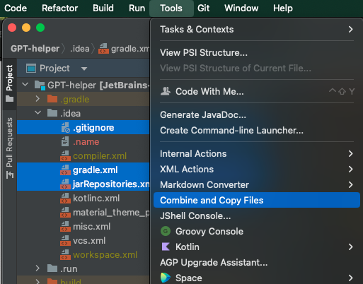

### JetBrains Plugin - Combine and Copy Files to Clipboard

[Plugin Link]([https://plugins.jetbrains.com/plugin/24753-combine-and-copy-files-to-clipboard/])

**The Combine and Copy Files to Clipboard Plugin** combines multiple files into one document, split by relative filepath/name and copies the result to the clipboard.
Ideal for combining multiple frontend components, code snippets, logs, or notes for pasting into AI tools for better context.

**Installation:**
- Go to `Settings -> Plugins -> Marketplace` and search for `Combine and Copy Files to Clipboard` or use [Plugin Link]([https://plugins.jetbrains.com/plugin/24753-combine-and-copy-files-to-clipboard])

**Key Features:**
- **Multiple File Selection:** Select files directly from the project view and copy from the context menu.
- **Content Consolidation:** Merge files with headers including relative file paths (does not include username like /Users/George/...) for anonymity.

**How to Use:**
1. **Select Files:** Use Ctrl + Click or Cmd + Click in Project view.
2. **Combine Files:** Right-click the selected files in the project vies and select Combine and Copy Files to Clipboard, or go to Tools -> Combine and Copy Files to Clipboard.
3. **Clipboard Copy:** Merged content is copied to the clipboard split by the relative paths/names of the files.
4. **Paste and Save:** Paste the content in your desired location.

**Use Cases:**
- **ChatGPT Integration:** Merge any types of files for context-rich AI assistance.
- **Code Review:** Combine source files for comprehensive reviews.
- **Documentation:** Consolidate notes and snippets for easy sharing.
- **Data Analysis:** Merge logs and reports for unified analysis.
- **Content Creation:** Compile research notes or chapters for seamless editing.
